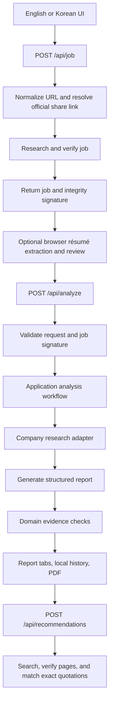

# Architecture

KnowBoth is a small layered Next.js application. The main architectural boundary is between **framework-independent evidence rules** and **code that renders UI or performs I/O**. Modules have concrete responsibilities; there is no dependency-injection container, repository abstraction without a database, or generic agent framework.

## Module map

| Layer             | Modules                                                                                                    | Responsibility                                                                                  |
| ----------------- | ---------------------------------------------------------------------------------------------------------- | ----------------------------------------------------------------------------------------------- |
| Presentation      | `components/knowboth-app.tsx`, `components/knowboth/`, `components/recommended-jobs.tsx`                   | Screens, report tabs, interaction state, focus, and request cancellation                        |
| Locale            | `components/locale-provider.tsx`, `lib/i18n/`                                                              | Current UI language, text catalogs, dates, currency, and PDF labels                             |
| Domain            | `lib/knowboth/schema.ts`, `evidence.ts`, `recommendation-core.ts`, `wanted-url.ts`, `analysis-contract.ts` | Runtime contracts, evidence validation, recommendation verification, and pure URL normalization |
| Application       | `lib/knowboth/analyze.ts`, `recommendations.ts`                                                            | Research/generation sequence, company selection, evidence checks, and recommendation workflow   |
| Provider adapters | `lib/knowboth/openai.ts`, `job-research.ts`, `prompts.ts`                                                  | OpenAI request/response mapping, research instructions, and job-page verification               |
| HTTP adapters     | `app/api/`, `lib/server/http.ts`                                                                           | Request validation, status codes, language negotiation, and public error messages               |
| Server utilities  | `lib/server/bounded-text.ts`, `wanted-url.ts`, `retry.ts`, `lib/knowboth/job-proof.ts`                     | Bounded streams, allowlisted redirects, recoverable retries, and signed job integrity           |
| Browser adapters  | `lib/knowboth/client-api.ts`, `history.ts`, `resume-file.ts`, `pdf.ts`                                     | API response validation, local report history, file extraction, and PDF creation                |
| Demo fixture      | `lib/knowboth/sample-report.ts`                                                                            | Explicitly fictional bilingual data shared by the demo and browser checks                       |

The analysis workflow depends on the provider-independent `AnalysisServices` function contract. Its HTTP route supplies the concrete `researchCompany` and `analyzeJob` adapters; tests supply ordinary functions without network or provider mocks. The research data and recoverable error contracts also live outside the adapter. Domain logic does not import providers, UI, routes, or server modules. The recommendation workflow still composes its concrete provider steps and accepts an injectable `fetch` function for transport checks; it does not yet have a separate application-level service contract.

ESLint enforces these import directions and disallows browser/network globals in domain modules. Browser modules cannot import server workflows. Server modules cannot import screens or routes. A forbidden import fails `npm run lint` and CI.

## Request flow

1. `/api/job` accepts a canonical Wanted URL or official share link. Redirects are limited to approved hosts. Job research must establish the exact requested posting before returning a signed `JobInput`.
2. `/api/analyze` validates the JSON contract and signature before external calls. The application workflow researches the company, requests clarification for an ambiguous legal entity, generates a report, then validates its evidence.
3. Company identity and revenue are restored from verified research data before the report is returned. The report-generation model cannot replace them with its own values.
4. Recommendations form an independent workflow started by the user. Candidate URLs must have appeared in search-provider sources, each page is checked, and both job and experience quotations must match their originals. A recommendation failure leaves the original report available; changing the interface language does not automatically start a paid search.

Each API adapter returns `Cache-Control: no-store`. HTTP JSON bodies are read with a shared byte limit and cancellation support. The routes own the overall request deadlines; recoverable AI failures can retry within those deadlines.

## Contracts and evidence

Zod schemas are executable contracts, not TypeScript-only assertions. Inputs and reports are validated at trust boundaries. The deterministic core then applies policy:

- Evidence quotations must occur in the original job/profile text after whitespace normalization.
- Missing experience evidence becomes unknown; absence alone is not proof of a skill gap.
- Application conditions and skill fit are separate concepts.
- Unknown source IDs are removed; unsupported claims are downgraded or removed.
- Unresolved company identity, conflicting revenue, and unknown accounting scope cannot produce a headline revenue figure.
- The absence of a profile disables personalized experience conclusions.

These checks establish structural and quotation integrity. They do not establish that every linked page semantically proves every company claim. The UI exposes sources and uncertainty so a reader can review them.

## Language behavior

English and Korean share the same schemas and business rules. UI copy and display formatting live outside the analysis core. The selected language is included in API requests through `X-KnowBoth-Locale`; responses declare `Content-Language`. Older API callers without that header retain Korean responses.

Provider instructions request explanations in the selected language. Direct job and résumé quotations, identifiers, source URLs, and legal names retain their original values. Existing report content is not silently rewritten merely because the interface language changes. The built-in demo has explicit English and Korean fixtures.

## Persistence and privacy

There is no application database or account system. Files are parsed in browser memory. An analysis sends extracted text to the server and provider; company/job web-search requests do not include the résumé. Recommendation search terms are derived separately before web search.

Recent real reports are stored locally, validated when read, and bounded to ten records and approximately two million serialized characters. A report can contain quoted experience. Original files, full résumé inputs, and integrity signatures are not stored by report history. Recommendations use a short-lived in-memory cache.

The job signature binds the exact researched fields. It is not authentication, an expiration mechanism, or a spending control. Public live deployments still need appropriate access and usage controls outside the current app.

## Validation and change ownership

- `npm test`: Node's test runner with automatically discovered TypeScript tests bundled by the existing esbuild dependency. External requests use deterministic fixtures.
- `npm run check`: formatting, architecture lint, TypeScript, and core/API checks.
- `npm run build`: production build.
- `npm run test:ui`: browser smoke tests against that build, with intercepted API responses and screenshots under `work/ui/`.

Keep rules in the domain, I/O in adapters, and orchestration in the application workflow. A UI copy change should not require editing evidence rules; a provider transport change should not require editing a report component. See [Contributing](../CONTRIBUTING.md) for the review workflow.
