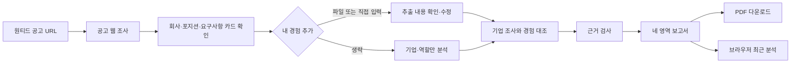
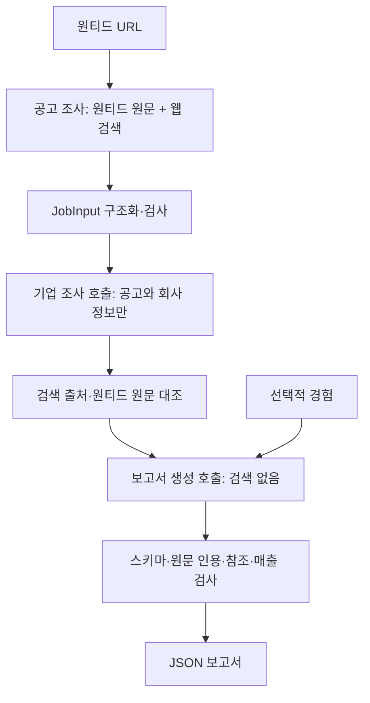

# KnowBoth — 구현 명세

기준일: 2026-09-19 · 상태: MVP 구현, Vercel 배포 준비

KnowBoth는 지원자가 한 기업과 한 포지션을 깊게 이해하도록 돕는 기업 분석기다. **Know the company. Know yourself.**라는 약속 아래 회사가 돈을 버는 방식, 역할이 필요한 이유, 사용자가 보여줄 경험과 다음 준비 행동을 하나의 근거 기반 보고서로 연결한다.

## 제품 목표

사용자가 보고서를 읽고 다음 질문에 자기 말로 답할 수 있어야 한다.

1. 이 회사는 누구의 어떤 문제를 해결하고 무엇으로 돈을 버는가?
2. 확인 가능한 매출과 최근 사업 변화는 무엇인가?
3. 이 역할은 어떤 문제를 맡고 왜 필요할 가능성이 있는가?
4. 내 경험 중 무엇을 보여줄 수 있고 무엇을 더 확인해야 하는가?
5. 지원서와 면접을 위해 지금 무엇을 준비해야 하는가?

핵심 연결은 **사업 → 회사의 문제 → 포지션의 역할 → 요구 역량 → 내 경험 → 준비 행동**이다. 합격 확률이나 종합 점수 대신, 원문까지 따라갈 수 있는 근거와 남은 질문을 제공한다.

## 구현 범위

| 영역 | 현재 동작 |
|---|---|
| 공고 조사 | `https://www.wanted.co.kr/wd/숫자` URL을 받아 원티드 페이지와 웹 검색으로 회사·포지션·주요 업무·자격요건·우대사항을 구성하고 카드로 확인 |
| 경험 입력 | 직접 입력 또는 PDF·DOCX·TXT·MD에서 브라우저 추출. 추출 결과를 사용자가 수정 가능 |
| 기업 조사 | OpenAI Responses API 웹 검색으로 법인·사업·공식 재무 자료 조사. 검색 도구가 실제 반환한 출처만 보존 |
| 법인 확인 | 동명 기업 후보가 있으면 선택을 받고 재실행하거나, 매출 분석을 생략하고 계속 진행 |
| 역할 분석 | 주요 업무·필수·우대·지원 조건 분리, 공고에 명시된 사실과 채용 배경 가설 구분 |
| 개인화 | 경험이 있을 때만 역량 대조와 조건 확인. 경험이 없으면 기업·역할 보고서만 생성 |
| 진행 화면 | 공고 확인과 기업 분석의 순서를 단계 목록으로 표시. 현재 서버 경계를 넘겨받는 스트리밍 진행률은 아님 |
| 보고서 | 기업 이해·채용 배경·나와 비교·지원 준비의 네 탭, 출처, Nanum Gothic을 내장한 PDF 다운로드 |
| 최근 분석 | 검증된 실제 보고서를 브라우저 `localStorage`에 최대 10개 보관하고 API 재호출 없이 다시 열기·개별 삭제 |
| 실패 처리 | 입력 유지, 취소, API 설정·시간 초과·형식 오류 메시지, 매출 미확보 상태 표시 |

계정, 서버 보고서 저장, 기기 간 동기화, 공유 링크, 기업 비교, 공고 대량 수집, 자동 지원, 자기소개서 대필, 모의 면접, OpenDART API 직접 연동은 현재 범위가 아니다.

## 사용자 흐름



가입 없이 `/` 한 화면에서 URL 입력 → 공고 확인 로딩 → 선택적 이력서 → 기업 분석 로딩 → 보고서 순서로 진행한다. 로딩 화면은 분석 항목의 순서를 표시하며, 서버가 중간 이벤트를 보내는 실시간 세부 진행률은 아니다. 모든 비홈 화면의 홈 버튼은 실행 중인 요청을 취소하고 URL과 최근 분석을 유지한 채 첫 화면으로 돌아간다. “가상 예시 보기”는 사용법을 보여주며 실제 조사 결과와 분명히 구분한다. 오류가 나도 입력 내용은 화면에 유지된다.

## 보고서 규칙

### 기업 이해

고객, 고객 문제, 제품·서비스, 수익 방식, 이 역할의 기여를 연결한다. 매출은 법인명, 금액, 통화, 기간, 연간·분기·누적, 연결·별도, 출처가 함께 확인될 때만 대표 수치로 표시한다. 투자금·거래액·ARR·모회사 매출을 해당 법인의 매출로 대신하지 않는다.

매출 상태는 `available / not_found / access_failed / identity_unresolved / conflicting / skipped`다. 자료 없음은 0원이 아니며, 법인 식별이나 회계 범위가 불명확하거나 자료가 충돌하면 `selected`를 비운다.

### 채용 배경

조사된 공고에 있는 역할과 요구를 먼저 제시한다. 채용 목적은 `공고에 명시 / 근거에 따른 해석 / 확인 필요`로 구분한다. 가설은 최대 3개이며 다른 가능한 설명과 면접 질문을 함께 둔다. 증원, 결원 대체, 긴급성, 내부 조직 문제는 직접 근거 없이 사실로 단정하지 않는다.

### 나와 비교

`required / preferred / work` 요구는 `evidence / partial / gap / unknown`으로 판단한다. 이력서에 없다는 이유만으로 `gap`을 만들지 않으며, 명시적인 미경험 등 원문 근거가 없으면 `unknown`이다. 연차·자격 같은 `condition`은 `met / not_met / unknown`으로 별도 처리한다.

### 지원 준비

강조할 경험 최대 3개, 준비할 일 최대 3개, 확인할 질문 최대 5개를 만든다. 실제 경험과 공고 요구에 연결하며 없는 성과·수치·도구를 추가하지 않는다.

세부 분석 지침은 [ANALYSIS_PROMPT.md](ANALYSIS_PROMPT.md)를 따른다.

## 기술 구조

- Next.js 16.2 App Router, React 19, TypeScript, Node.js 22
- Vercel Node.js Functions
- Zod 데이터 계약과 후처리 검증
- OpenAI Responses API의 웹 검색과 Structured Outputs
- 브라우저용 PDF.js, Mammoth, TextDecoder, jsPDF
- PDF에 내장하는 Nanum Gothic Regular/Bold와 SIL Open Font License 1.1 파일
- 서버·DB·큐·벡터 저장소·런타임 에이전트 프레임워크 없음



한 번의 새 분석에는 공고 조사, 기업 조사, 보고서 생성의 AI 호출이 순서대로 실행된다. 공고·기업 조사 호출에는 이력서, 개인 선호, 연락처를 보내지 않는다. 마지막 보고서 생성 호출에서만 선택적인 사용자 경험을 사용한다.

## API

### `POST /api/job`

입력:

```json
{
  "url": "https://www.wanted.co.kr/wd/123"
}
```

`url`은 `https`, `www.wanted.co.kr`, `/wd/양의 정수`를 모두 만족해야 하며 사용자 정보가 포함된 URL과 다른 호스트·경로는 거부한다. 마지막 슬래시는 허용하고 쿼리와 조각은 제거해 `https://www.wanted.co.kr/wd/숫자` 형태로 정규화한다. 서버는 OpenAI 웹 검색으로 같은 공고 ID를 조사한다. 회사명, 포지션명, 주요 업무, 자격요건, 우대사항을 정리한 `JobInput`을 반환하며 `inputMethod`는 `ai_research`다. 성공 응답은 `{ "status": "ready", "job": JobInput, "jobProof": "v1.…", "message": null }`이다. `jobProof`는 서버 키로 JobInput 전체를 서명한 값이며 브라우저 메모리에만 둔다. 사용자가 공고 본문이나 회사·포지션명을 직접 입력하는 경로는 없다.

요청은 엄격한 `{ url }` JSON이며 2KB 이하여야 한다. 서버는 정규화한 원티드 URL의 HTML을 최대 1MB까지 읽어 숨김 요소를 제거한 표시 텍스트를 만들고, AI 웹 검색 결과의 회사명·포지션·주요 업무·자격요건을 이 텍스트와 대조한다. 직접 원문을 확보하면 원문에 정확히 있는 항목만 남기며 회사명·포지션·주요 업무·자격요건이 모두 확인되어야 한다. 원티드 원문을 직접 읽지 못한 경우에는 검색 제공자가 요청한 정확한 공고 URL을 실제 출처로 반환해야 한다. 두 경로 모두 구조화 공고 ID가 요청 ID와 같아야 한다. 모델 출력 스키마에는 URL 필드가 없어 모델이 만든 링크는 `JobInput`에 들어갈 수 없다. 이 조건을 충족하지 못하거나 공고가 만료·삭제·비공개 상태면 임의로 채우지 않고 실패한다. 앱 자체 제한은 50초이고 Vercel 함수의 `maxDuration`은 60초다.

`/api/job`과 `/api/analyze`는 별도 접근 코드 없이 공개된다. 두 POST 라우트는 브라우저가 `Origin`을 보낸 경우 현재 사이트와 같은 출처인지 검사한다.

### `GET /api/analyze`

`{ "available": boolean, "modelConfigured": boolean }`을 반환한다. 키와 모델 값 자체는 노출하지 않는다.

### `POST /api/analyze`

입력은 `{ job, profile, companyHint, companyResolution }`이다. `job`은 `/api/job`이 조사한 결과이며, 브라우저는 함께 받은 서명을 `X-KnowBoth-Job-Proof` 헤더로 보낸다. 서버는 서명, 정규 원티드 URL, `userEdited: false`를 AI 호출 전에 검사한다. `profile`과 `companyHint`는 null일 수 있고 `companyResolution`은 `auto | selected | skip_financials`다. 조사된 공고 텍스트와 경험 텍스트는 각각 20,000자, 전체 입력은 UTF-8 기준 160KB 이하이며 HTTP 요청은 170KB에서 한 번 더 차단한다.

분석 접근 코드는 요구하지 않는다. `OPENAI_API_KEY`는 서버 환경변수로만 설정하고 브라우저에 노출하지 않는다.

서버는 기업 조사와 보고서 생성의 두 OpenAI 호출을 순서대로 실행한다. 법인이 모호하고 후보가 있으면 `{ "type": "needs_company", "candidates": [...] }`를 반환해 선택 또는 매출 생략을 받는다. 그 밖에는 검사를 통과한 `{ "report": Report }` 단일 JSON 응답을 반환한다. 현재 NDJSON 스트리밍이나 부분 보고서는 구현하지 않았다. 전체 작업은 110초에 중단되며 라우트의 Vercel 최대 실행 시간은 120초다. 자동 재시도는 없다.

두 POST 라우트 모두 다른 브라우저 출처의 요청은 403, `jobProof`가 없거나 일치하지 않으면 401, `OPENAI_API_KEY`가 없으면 503, 입력 오류는 400·413·415, 외부 호출 또는 결과 검증 실패는 502, 시간 초과는 504를 반환한다. `/api/job`은 OpenAI 요청 제한에 429, `/api/analyze`는 선택한 법인이 재조사 결과와 일치하지 않으면 409도 반환한다.

## 파일과 개인정보

PDF·DOCX·TXT·MD 원본 파일은 브라우저에서만 읽는다. 8MB를 초과하거나 PDF가 40쪽을 넘으면 거부한다. 스캔·이미지 PDF, 암호화 PDF, HWP는 지원하지 않는다. 추출 내용이 20,000자를 넘으면 자동으로 자르지 않고 사용자가 줄이도록 안내한다.

공고 확인을 누르면 URL이 서버와 OpenAI 검색 호출에 전달된다. 분석 버튼을 누르면 조사된 공고와 선택적인 경험 텍스트가 서버와 OpenAI에 전달된다. OpenAI 요청에는 `store: false`를 사용하고 서버 DB에는 입력이나 보고서를 저장하지 않는다.

완료한 실제 보고서는 최근 분석을 위해 `knowboth.analysis-history.v1` 키로 브라우저 `localStorage`에 저장한다. 저장 전에 `reportSchema`로 다시 검증하며 최신순 최대 10개, 직렬화 문자열 약 200만 자로 제한한다. 용량 초과 시 오래된 기록부터 줄이고 저장소 오류·손상 기록은 무시한다. 기록에는 공고 URL, 생성 시각, 회사·포지션과 전체 보고서가 포함되므로 분석에 사용된 경험 인용도 남을 수 있다. 이력서 원본과 `jobProof`는 저장하지 않는다. 기록은 서버나 다른 브라우저와 동기화되지 않으며 개별 삭제 또는 사이트 데이터 삭제로 제거할 수 있다. 이는 모델 제공자의 별도 처리·보존 정책까지 포함해 “어디에도 저장되지 않는다”는 보장은 아니다.

PDF 다운로드는 브라우저에서 jsPDF를 동적 로드하고 `/fonts/NanumGothic-Regular.ttf`와 `/fonts/NanumGothic-Bold.ttf`를 같은 출처에서 가져와 문서에 내장한다. 글꼴 원본과 OFL 전문은 [`public/fonts`](../public/fonts/README.md)에 있다. 글꼴은 PDF를 만들 때만 내려받는다.

## 근거 검증

서버는 모델 출력만 신뢰하지 않고 다음 경계를 검사한다.

- 출처 URL은 자격증명이 없는 HTTP(S)만 허용한다.
- 웹 검색 호출에서 확인되지 않은 URL은 조사 자료에서 제외한다.
- 회사 식별과 매출은 조사 단계의 검증된 값을 최종 보고서에 다시 주입해 보고서 생성 모델이 바꾸지 못하게 한다.
- 공고 인용은 공고 조사 단계에서 구성한 텍스트, 경험 인용은 사용자 입력에서 공백만 정규화한 뒤 정확히 존재해야 한다.
- 조사된 공고 텍스트에 없는 요구는 제거하고, 근거 없는 경험 판단은 `unknown`으로 낮춘다.
- 존재하지 않는 Source ID를 제거하며 근거가 사라진 주장은 `unknown`, 채용 가설은 제외한다.
- 프로필이 없으면 `fitItems`와 `conditionChecks`는 null이고 개인 경험 강조 행동을 만들지 않는다.
- 조건 요구가 역량 대조에 섞이거나 역량 요구가 조건 검사에 들어가면 스키마 검증에 실패한다.
- 법인 식별 근거가 없으면 `unresolved`로 낮추고 대표 매출을 표시하지 않는다.
- 충돌 상태, 회계 범위 불명, 원자료·출처 불일치 매출은 대표값을 표시하지 않는다.

이 검사는 구조·참조·문자열 일치를 확인한다. 원티드 표시 텍스트를 확보한 경우 AI가 추출한 회사명·포지션·업무·자격요건을 해당 텍스트와 정확히 대조한다. 직접 원문을 확보하지 못하면 검색 제공자의 정확한 URL 인용을 요구한다. 이후 보고서의 공고 인용은 이 과정을 통과해 구성한 공고 텍스트에 있어야 한다. 이 검사도 페이지가 모든 요약·기업 주장·매출 수치를 의미상 뒷받침하는지까지 자동으로 증명하지는 못한다. 중요한 요구사항, 매출, 법인 정보와 해석은 실제 지원 전 링크를 열어 사람이 확인해야 한다.

## 검증과 알려진 제한

```sh
npm test
npx tsc --noEmit
npm run lint
npm run build
```

핵심 계약 테스트는 인용·출처·법인·매출·개인화 경계를 다룬다. 배포 후에는 서로 다른 회사와 직무의 실제 공고를 최소 3건 사람이 대조해야 한다.

현재 제한:

- 원티드 원문 요청이 차단되면 검색 제공자의 정확한 공고 URL 인용으로 검증한다. 원문과 정확한 인용을 모두 확보하지 못하면 공고 조사가 실패하며 수동 본문 입력 경로는 없다.
- OpenDART API를 직접 연결하지 않아 검색에 노출되지 않은 공시를 놓칠 수 있다.
- 응답은 완료 후 한 번에 오며 로딩 단계는 서버의 세부 진행 이벤트를 받지 않는다. 중간 결과도 보존하지 않는다.
- 브라우저 최근 분석은 있지만 사용자 계정, 서버 영구 저장, 기기 간 동기화, 서버 캐시, 사용자·IP별 요청 제한, 비용 할당량은 없다.
- 공고 조사까지 포함해 새 분석에 AI 호출이 최대 3회 필요하다. 실제 정확도·지연·비용은 모델, 검색 결과, 계정 한도에 따라 달라진다.

Vercel 설정과 운영 점검은 [SOL_HANDOFF.md](SOL_HANDOFF.md)에 정리되어 있다.
